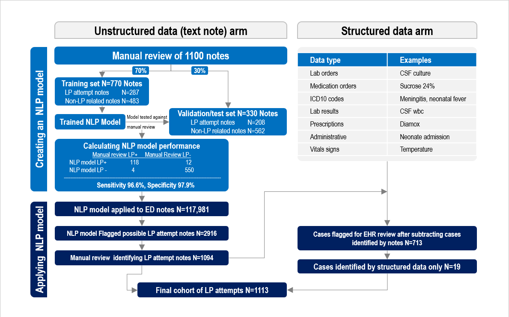

```{r, include=FALSE}
knitr::opts_chunk$set(results = 'asis',
                      echo = FALSE,
                      warning = FALSE,
                      tidy = FALSE,
                      message = FALSE,
                      fig.align = 'center',
                      out.width = "100%")
options(knitr.table.format = "html") 
```

# Background

The frequency of lumbar punctures (LPs) procedures has declined over the past two decades with uncertain impacts on lumbar puncture competence. Unsuccessful LPs can be challenging to identify using available administrative or self-reported data.

# Objectives

Our goal was to identify the proportion of attempted LPs that were ultimately unsuccessful.


# Methods

We performed a retrospective cross-sectional study of all ED encounters for children 21 years or younger who presented between 2017-2019 to a tertiary care pediatric center. We defined an unsuccessful LP as no CSF obtained, CSF culture only, or CSF RBC ≥ 10,000 cells/mm$^{3}$. 

<br>
<br>
<br>

We developed a Natural Language Processing (NLP) model to identify these procedures from unstructured data (clinical note text), using a sample of manually reviewed notes from one year of data. We randomly selected 70% of the notes as a training set, and held aside the remaining 30% of notes as a validation/testing set. We compared NLP model classification to the manual chart review and calculated the sensitivity and specificity of the classifier for identifying notes describing an LP attempt. We then applied the NLP model to all ED notes during the study period and reviewed the output manually. 

We also used unstructured data (e.g. physician orders, laboratory results, billing codes) to flag cases for manual review. 

# Results

In the validation cohort, the NLP model identified 118 of the 122 LPs identified by medical records review: sensitivity 96.6% (95% CI 93.4-99.9%) and specificity 97.9% (95% CI 96.4-99.3%). The NLP model was then applied to 117,981 ED encounters during the study period and the NLP classifier output provided 2916 notes for manual review, of which we identified 1,094 notes describing an LP attempted. Screening an additional 713 cases flagged by structured data, identified an additional 19 cases, for an overall 1113 ED encounters with LP attempts (0.63% of encounters) (see figure \@ref(fig:lp-flowsheet).)

Unsuccessful LPs occurred in 226/1113 (20.3%). Of these, fluid was not obtained in 104 (9.3%), LP sent for culture only in 53 (4.8%), and LP with ≥ 10,000 CSF RBC cells/mm$^{3}$ in 69 (6.2%). 

<br>
<br>


```{r lp-flowsheet, echo=FALSE,collapse=TRUE, fig.cap="Review process", out.width="100%"}



```

### Funding Acknowledgements

Mara Alexeev---Biomedical Informatics and Data Science Research Training Program, T15LM007092-30, PI Dr. Nils Gehlenborg, PhD
